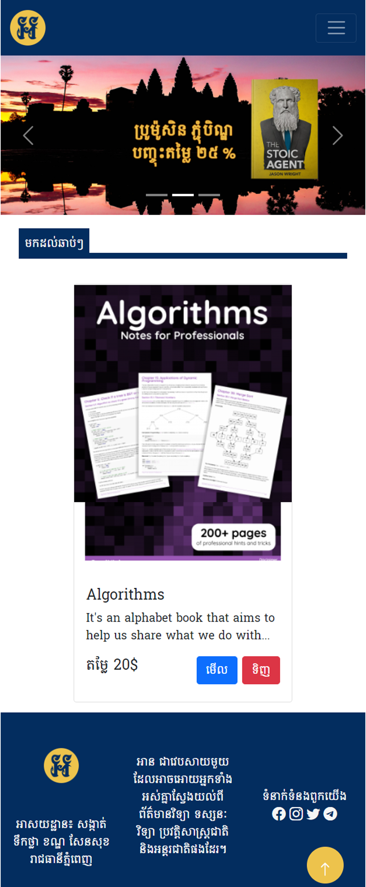

# E-Book Web-Project Template

Create using bootstrap, html, css and more javascript code.
I use more javascript code because I was create components into javascript file and we can reduce code and reuse code.
Language that use in this project is:  
Javascript 62.1%  
HTML 34.9%  
CSS 3.0%  

<b>Desktop View<b>
 
  
  <b>Mobile View<b>
 
